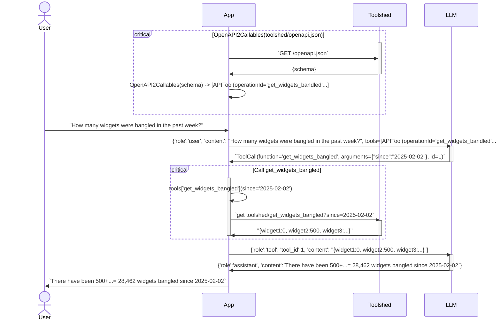

# OpenAPI2Callables

[](https://pypi.org/project/openapi2callables/)
[](https://pypi.org/project/openapi2callables/)
[](https://openapi2callables.readthedocs.io/en/latest/)
[](https://github.com/andrewbolster/openapi2callables/actions/workflows/pytest.yml)
[](https://codecov.io/github/andrewbolster/openapi2callables)
[](https://www.openhub.net/p/openapi2callables)

OpenAPI2Callables is a Python library for parsing and projecting OpenAPI endpoints into OpenAI/GenericLLM compatible Tools.

It's designed to be flexible enough for non-LLM directed usage as well.

## Motivation

OpenAPI is a widely used standard for describing RESTful APIs. OpenAI specified a fairly simple [tool calling API](https://platform.openai.com/docs/guides/function-calling). OpenAPI2Callables bridges the gap between OpenAPI and OpenAI by providing a way to parse OpenAPI schemas and project them into OpenAI compatible tool definitions and provide a 'proxy' to those OpenAPI functions from a calling service.

i.e. One can separate responsibilities from a tool calling service (toolshed?), and the actual LLM interacting client function, such as a chatservice or a local CLI.

## Example

Here's an example of the interaction between a User, an App, a Toolshed, and an LLM:

The User interacts exclusively with the App. On initialisation of the App, the App uses OpenAPI2Callables to query and parse the OpenAPI schema from the Toolshed. The App then projects the OpenAPI schema into OpenAI compatible tool definitions. When the User asks a question, the App calls the LLM with the question, including the tools generated.

The LLM may then call the App with a tool call, including the tool ID and arguments. The App then calls the Toolshed with the tool call (via the APITool.**call** interface, i.e. 'tool(\*args,\*\*kwargs)), and the Toolshed returns the result. The App then returns the result to the LLM, which then returns a synthesised result to the User (via the App, again).



## Features

- Parse OpenAPI JSON/YAML schemas and extract basic parameter and response configurations
- Host a sample server for testing and demonstration
- Project tool definitions into OpenAI compatible tool definitions
- Provide runtime callbacks for tool execution

## Installation

You can install OpenAPI2Callables using pip:

```
pip install openapi2callables
```

## Quick Start

Here's a simple example of how to use OpenAPI2Callables:

```python
from openapi2callables import parse_spec, get_spec, APITool

# Load an OpenAPI specification
spec_url = "https://example.com/api/openapi.json"
spec = get_spec(spec_url)

# Parse the specification
tools = parse_spec(spec)

# Use the parsed tools in your application
tools = {}
for tool in tool_specs:
    print(f"Tool: {tool.name}")
    print(f"Description: {tool.description}")
    print(f"Parameters: {tool.parameters}")
    print("---")

    tools[tool.name] = APITool(tool)

# Use the tools in your application
response = tools["get_user"](user_id=123)
print(response)
```

## CLI Usage

OpenAPI2Callables also provides a command-line interface:

```
openapi2callables parse https://example.com/api/openapi.json # Parse an OpenAPI specification and dump the specs to the console, mostly for debugging
openapi2callables serve https://example.com/api/openapi.json # Start a sample server for testing and demonstration
```

## Contributing

Contributions are welcome! Please feel free to submit a Pull Request.

## License

This project is licensed under the MIT License - see the LICENSE file for details.

## Roadmap

- \[ \] Provide request authorization passthrough
- \[ \] Enhance error handling and validation
- \[ \] Add support for more complex OpenAPI features
- \[ \] Improve documentation and examples
